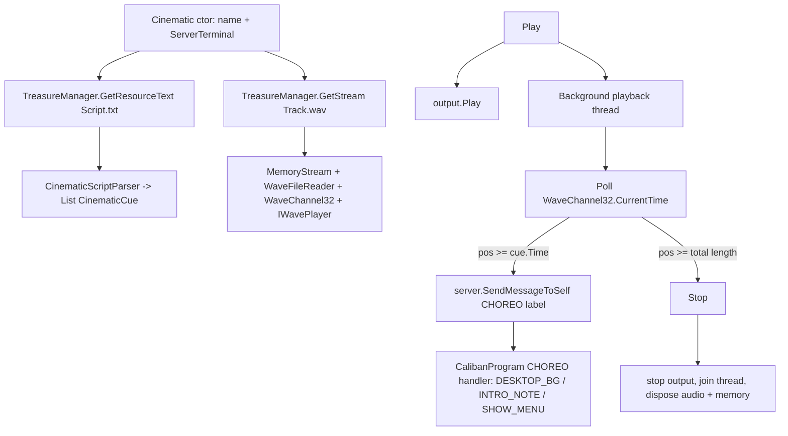

# Requirements

### Overview & Goals
Build a data-driven **cinematic system** in the `Caliban.Core.Cinematics` namespace that plays a narrated/scored sequence: an audio track plays while timestamped script cues are dispatched into the game's transport layer at the right moments. The first concrete cinematic is `Intro`, whose assets already exist under `Resources/Cinematics/Intro` (`Script.txt` + `Track.wav`).

The system replaces the old hardcoded `Thread.Sleep`-based timing in `Menu.Intro_Legacy` with a reusable, script-driven mechanism.

### Scope
**In Scope**
- Loading a cinematic's script (`.txt`) and track (`.wav`) fully into memory when the `Cinematic` is created.
- Parsing the Audacity-style label script (`start<TAB>end<TAB>label`) into an ordered list of cues.
- A `Play()` that starts audio on its own NAudio output and spins up a background playback thread.
- Dispatching each cue's label as a `CHOREO` message directly to the transport layer (in-process, no socket) when audio playback position reaches the cue time.
- A `Stop()` that halts audio, stops/disposes the playback thread, and releases audio/memory resources.

**Out of Scope**
- Authoring/editing tools for scripts (the `.aup3` Audacity project stays as-is content).
- New message types or changes to the wire protocol.
- Pausing/seeking/scrubbing a cinematic (only Play and Stop are required).
- Visual sequencing beyond dispatching existing `CHOREO` messages.

### User Stories
- As a game developer, I want to create a `Cinematic("Intro")` and have its script + audio loaded into memory so I can trigger it on demand.
- As a game developer, I want `Play()` to start the audio and automatically fire the scripted cues in sync with the track so the intro sequence choreographs itself.
- As a game developer, I want `Stop()` to immediately end playback and clean up the thread/audio so no resources leak and no further cues fire.

### Functional Requirements
1. Constructing a `Cinematic` with a name (e.g. `"Intro"`) loads `Cinematics/<Name>/Script.txt` and `Cinematics/<Name>/Track.wav` from embedded resources into memory.
2. The script parser reads each non-empty line as `start\tend\tlabel`, using the **start** time (seconds, invariant culture) as the cue time and the label as the message payload.
3. `Play()` starts audio playback and a background thread; as the audio's actual playback position passes each cue time, the cue's label is dispatched exactly once as `Messages.Build(MessageType.CHOREO, label)` via `ServerTerminal.SendMessageToSelf(...)` (direct in-process call, no localhost socket).
4. When playback reaches the end of the track, the cinematic stops itself and cleans up.
5. `Stop()` stops audio, ends and disposes the playback thread, and prevents any remaining cues from firing.
6. Calling `Play()` when already playing is a no-op; calling `Stop()` when not playing is safe.

### Non-Functional Requirements
- Cue dispatch is driven by the real audio device position (`WaveChannel32.CurrentTime`) so cues stay in sync even if audio start is delayed.
- Thread-safe start/stop; the background thread is a background (daemon) thread and is joined/released on `Stop()`.
- No changes to existing transport, audio mixing, or resource-packaging behavior for other features.

# Technical Design

### Current Implementation
- **Skeleton**: `Caliban/Cinematics/Cinematic.cs` (empty `Cinematic(string filePath)`, `Play()`, `Stop()`) and `Caliban/Cinematics/CinematicPlayer.cs` (static `PlayCinematic`/`StopCinematic`/unused `Update`). Both are already in `Caliban.csproj` (lines 64-65).
- **Assets (already present, embedded)**: `Resources/Cinematics/Intro/Script.txt` and `Track.wav` are `EmbeddedResource` in `Resources.csproj` (lines 87-88) inside the `Treasures` assembly.
- **Script format** (`Script.txt`) is Audacity label export: `start<TAB>end<TAB>label`, e.g. `7.433833\t7.433833\tDESKTOP_BG`. Labels `DESKTOP_BG`, `INTRO_NOTE`, `SHOW_MENU` map exactly to the `CHOREO` string cases in `CalibanProgram.ServerOnMessageReceived` (lines 112-131).
- **Resource loading**: `TreasureManager.GetStream("Cinematics.Intro.Track.wav")` and `TreasureManager.GetResourceText("Cinematics.Intro.Script.txt")` read embedded resources (dots replace folder separators).
- **Audio**: `WavePlayer` wraps `WaveFileReader`/`WaveChannel32` and already supports a `Stream` constructor that copies into a `MemoryStream`. `AudioManager` uses a shared `DirectSoundOut` mixer but exposes no playback position.
- **Transport / direct dispatch**: `ServerTerminal.SendMessageToSelf(byte[])` calls `OnMessageReceived` directly, firing the `MessageReceived` event that `CalibanProgram`, `Game`, and `WaterManager` subscribe to — this is the required “direct function call, not localhost” path. `Messages.Build(MessageType, string)` builds the payload.

### Key Decisions
- **Timing source = audio device position** (confirmed): the `Cinematic` owns its own NAudio output and the playback thread polls `WaveChannel32.CurrentTime` (not a `Stopwatch`), so cues stay synced to actual audio.
- **Message mapping = `CHOREO` + label value** (confirmed): each cue dispatches `Messages.Build(MessageType.CHOREO, label)`; no script-format or protocol changes, and it hits the existing `CalibanProgram` CHOREO handler.
- **Resource source = embedded by name** (confirmed): assets loaded via `TreasureManager` using the cinematic name; both files are read fully into memory at construction.
- **Transport target = `SendMessageToSelf`**: routes cues to in-process server-side handlers, matching the existing intro choreography path.
- **Dedicated audio output**: the `Cinematic` uses its own `IWavePlayer` (e.g. `WaveOutEvent`) rather than the shared `AudioManager` mixer, because we need per-cinematic position + start/stop lifecycle.

### Proposed Changes
1. **`CinematicCue`** (new): lightweight model holding `TimeSpan Time` and `string Label`.
2. **`CinematicScriptParser`** (new): static parser turning script text into an ordered `List<CinematicCue>`; splits each non-empty line on tabs, parses the first field as seconds with `CultureInfo.InvariantCulture`, takes the last field as the label; ignores blank/malformed lines.
3. **`Cinematic`** (rewrite of skeleton):
   - Constructor `Cinematic(ServerTerminal server, string cinematicName)`: stores `server`; loads script text via `TreasureManager.GetResourceText($"Cinematics.{name}.Script.txt")` → `CinematicScriptParser.Parse(...)`; loads `TreasureManager.GetStream($"Cinematics.{name}.Track.wav")` into a `MemoryStream`, builds a `WaveFileReader` + `WaveChannel32`, and inits a dedicated `IWavePlayer`.
   - `Play()`: guard against double-play; reset stream position and per-cue “dispatched” flags; start the output; launch a background playback thread running the poll loop.
   - Playback loop: while playing, read current audio position; dispatch any not-yet-fired cue whose `Time <= position` via `server.SendMessageToSelf(Messages.Build(MessageType.CHOREO, cue.Label))`; when position reaches total track length, call `Stop()`; sleep a short interval (~15-25 ms) between polls.
   - `Stop()`: set playing flag false; stop the output; join/release the thread; dispose output, channel, reader, and memory stream.
4. **`CinematicPlayer`** (adjust): becomes a thin static facade tracking the active cinematic (`PlayCinematic`/`StopCinematic` retained); the unused `Update(deltaTime)` stub is removed since timing lives in the cinematic's own thread.
5. **Integration (`App/CalibanProgram.cs`)**: expose a way to create and play the `Intro` cinematic (passing the existing `server`), replacing the legacy hardcoded timing so the embedded script drives `DESKTOP_BG`/`INTRO_NOTE`/`SHOW_MENU` through the existing CHOREO handler.

### Data Models / Contracts
```csharp
public readonly struct CinematicCue
{
    public readonly TimeSpan Time;   // from start field, seconds
    public readonly string Label;    // CHOREO payload, e.g. "DESKTOP_BG"
}

public static class CinematicScriptParser
{
    public static List<CinematicCue> Parse(string scriptText);
}

public class Cinematic
{
    public Cinematic(ServerTerminal server, string cinematicName);
    public void Play();  // starts audio + background dispatch thread
    public void Stop();  // stops audio, disposes thread + audio resources
}
```
Dispatch per cue: `server.SendMessageToSelf(Messages.Build(MessageType.CHOREO, cue.Label));`

### File Structure
- `Caliban/Cinematics/CinematicCue.cs` — **new** (cue model).
- `Caliban/Cinematics/CinematicScriptParser.cs` — **new** (script parsing).
- `Caliban/Cinematics/Cinematic.cs` — **modified** (load/play/stop implementation).
- `Caliban/Cinematics/CinematicPlayer.cs` — **modified** (facade cleanup).
- `Caliban/Caliban.csproj` — **modified** (add `<Compile Include>` for the two new files).
- `App/CalibanProgram.cs` — **modified** (create/play `Intro` cinematic via `server`).

### Architecture Diagram


### Risks
- **NAudio position accuracy**: `CurrentTime` on `WaveChannel32`/`WaveFileReader` reflects read position, which can slightly lead actual output; acceptable for cue timing at this granularity. Mitigation: poll on the underlying reader consistently.
- **Thread teardown**: ensure the loop checks a `volatile` playing flag and disposes NAudio objects only after the thread exits to avoid `ObjectDisposedException`.
- **Old-style csproj**: new files must be manually added to `Caliban.csproj` `<Compile>` items or they won't build.
- **Embedded resource name**: must use dotted form `Cinematics.<Name>.Script.txt`/`Track.wav` matching `TreasureManager`'s `Treasures.Resources.` prefix.

# Testing

### Validation Approach
Validate the parser deterministically with unit-style checks, then verify the playback/dispatch lifecycle by driving a `Cinematic` with a stubbed/real `ServerTerminal` and asserting that the correct `CHOREO` messages are dispatched via the in-process `SendMessageToSelf` path.

### Key Scenarios
- **Script parsing**: `CinematicScriptParser.Parse` on the real `Intro/Script.txt` content yields 3 cues with times ≈ 7.433833s, 14.743746s, 29.698419s and labels `DESKTOP_BG`, `INTRO_NOTE`, `SHOW_MENU`, in order.
- **Load into memory**: constructing `Cinematic(server, "Intro")` reads both embedded resources without throwing and produces a non-empty cue list and a valid audio reader with a total time > 0.
- **Dispatch on play**: subscribe a test handler to `ServerTerminal.MessageReceived`; call `Play()`; assert that `CHOREO` messages with values `DESKTOP_BG`, `INTRO_NOTE`, `SHOW_MENU` are received once each, in order, as playback position passes each cue.
- **Self-stop at end**: after the track finishes, the cinematic reports stopped and the background thread has exited.

### Edge Cases
- **Double Play / Stop-before-Play**: calling `Play()` twice does not start two threads or double-dispatch; `Stop()` before `Play()` is a safe no-op.
- **Stop mid-playback**: cues scheduled after the stop point are never dispatched, and the thread + audio resources are released (no `ObjectDisposedException`).
- **Malformed/blank script lines**: blank trailing line and lines with missing fields are skipped without throwing.
- **Missing resource name**: constructing with an unknown cinematic name fails gracefully (logged via `D.Write`, empty cue list) rather than crashing.

### Test Changes
- Add a focused parser test around `CinematicScriptParser.Parse` using the known `Intro` script text.
- Add a playback/dispatch test that uses a `ServerTerminal` and a captured `MessageReceived` handler; keep timing tolerances loose to avoid flakiness. Use `[DEBUG_LOG]`-prefixed console output while iterating.

# Delivery Steps

### ✓ Step 1: Add cue model and script parser
Script text can be parsed into an ordered list of timestamped cues.

- Add `Caliban/Cinematics/CinematicCue.cs` defining a `readonly struct CinematicCue { TimeSpan Time; string Label; }`.
- Add `Caliban/Cinematics/CinematicScriptParser.cs` with `static List<CinematicCue> Parse(string scriptText)`.
- Parse each non-empty line as `start\tend\tlabel`: first field parsed as seconds via `CultureInfo.InvariantCulture` into `TimeSpan`, last field used as the label.
- Skip blank/malformed lines defensively; preserve source order.
- Register both new files in `Caliban/Caliban.csproj` `<Compile Include>` items.

### ✓ Step 2: Load cinematic assets into memory in the constructor
Creating a `Cinematic(server, name)` loads its script and audio track fully into memory.

- Rewrite `Cinematic` constructor signature to `Cinematic(ServerTerminal server, string cinematicName)` and store the `server` reference.
- Load script via `TreasureManager.GetResourceText($"Cinematics.{name}.Script.txt")` and parse it with `CinematicScriptParser` into the cue list.
- Load `TreasureManager.GetStream($"Cinematics.{name}.Track.wav")` into a `MemoryStream`, then build a `WaveFileReader` + `WaveChannel32` and initialize a dedicated `IWavePlayer` (e.g. `WaveOutEvent`).
- Handle missing resources gracefully with `D.Write` logging and an empty cue list.

### ✓ Step 3: Implement Play/Stop with an audio-position-driven dispatch thread
`Play()` choreographs cues in sync with audio; `Stop()` cleanly tears everything down.

- Implement `Play()`: guard against re-entry, reset stream position and per-cue dispatched flags, start the output, and launch a background (daemon) playback thread.
- In the playback loop, poll `WaveChannel32.CurrentTime`; for each not-yet-fired cue whose `Time <= position`, dispatch `server.SendMessageToSelf(Messages.Build(MessageType.CHOREO, cue.Label))` exactly once.
- Self-stop when position reaches the track's total length; use a short poll sleep (~15-25 ms) and a `volatile` playing flag.
- Implement `Stop()`: clear the playing flag, stop the output, join/release the thread, and dispose output, channel, reader, and memory stream in a safe order.

### ✓ Step 4: Wire up the facade and Intro integration
The Intro cinematic can be created and played through the app, replacing legacy hardcoded timing.

- Adjust `CinematicPlayer` into a thin static facade that tracks the active cinematic via `PlayCinematic`/`StopCinematic`, and remove the now-unused `Update` stub.
- In `App/CalibanProgram.cs`, create a `Cinematic(server, "Intro")` and play it at the appropriate intro trigger point, relying on the existing `CHOREO` handler in `ServerOnMessageReceived` to process `DESKTOP_BG`/`INTRO_NOTE`/`SHOW_MENU`.
- Ensure the cinematic is stopped/cleaned up on game close or app shutdown paths so the thread and audio resources are released.