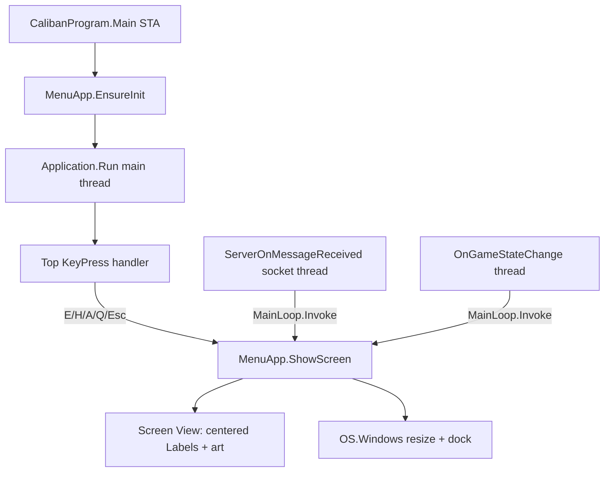

# Requirements

### Overview & Goals
Migrate the Caliban main-menu console subsystem (the `Menu` static class) from raw `Console` / `Colorful.Console` rendering to **Terminal.Gui (v1.x)**. The result must look **visually identical** to today (same ASCII art, centered layout, colors, prompts, and per-screen window sizing) while being more stable and less "raw" (no direct `Console.SetWindowSize`/`Console.Clear` flicker, no fragile `Console.ReadKey` loop).

### Scope
**In scope**
- Port **all seven menu screens** rendered by `Caliban/Menu/Menu.cs`: `Main`, `About`, `Help`, `Standby`, `Win`, `Lose`, `Cheat`.
- Replace the raw rendering (`ConsoleFormat.CenterWrite` / `Colorful.Console`) with Terminal.Gui views built from **custom centered `Label` views**.
- Replace the blocking `Console.ReadKey()` loop and `MenuLoop` switch in `App/CalibanProgram.cs` with Terminal.Gui key handling.
- Marshal cross-thread menu updates from `ServerOnMessageReceived` and `OnGameStateChange` through `Application.MainLoop.Invoke`.
- Add the Terminal.Gui dependency and raise the target framework to the minimum it supports.

**Out of scope**
- Changing menu wording, ASCII art, flow, hotkeys, or the intro/cinematic sequence.
- Migrating any non-menu console output (game modules, DebugLog, Note, Graphics, etc.).
- Redesigning the menu into a "standard" bordered TUI look (explicitly rejected — custom centered labels chosen).

### User Stories
- As the player, I see the exact same title screen, About/Help/Standby/Win/Lose/Cheat screens, colors, and `(E)mbark | (H)elp | (A)bout | (Q)uit` prompt as today, so nothing about the experience visibly changes.
- As the player, I use the same keys (`E`, `H`, `A`, `Q`, `Esc`) to navigate, and they respond reliably without the console entering selection/pause states.
- As the developer, the menu no longer flickers or breaks from direct `Console` buffer manipulation and is driven by a managed event loop.

### Functional Requirements
- Every screen renders the same text/art, centered, in the same colors (approximated to the nearest console colors — see Non-Functional).
- The `Main` screen still shows the `Alpha Version: x.y.z.r` line (from the entry assembly version) in dark gray.
- Per-screen window heights are preserved (Main 22, About 13, Help 12, Standby 6/10 in debug, Lose 13, Win 14, Cheat 17) and the window stays docked to the top-center of the primary screen.
- Keyboard navigation matches the current state machine exactly (MAIN → A/H/E/Q; ABOUT/HELP/STANDBY → Esc back to MAIN).
- Server messages (`SHOW_MENU`, `INTRO_NOTE`) and game-state changes (`WON`, `LOST`, `CHEATED`, `IN_PROGRESS`) still switch to the correct screen, now via the Terminal.Gui main loop.
- Intro flow (hide console, run graphics/cinematic, then show menu on `SHOW_MENU`) is preserved.

### Non-Functional Requirements
- **Colors:** Terminal.Gui v1 uses a 16-color palette; current true-color shades (Gold, Coral, Azure, DarkGray) are mapped to the nearest `Terminal.Gui.Color` values (approximation accepted).
- **Compatibility:** Terminal.Gui v1.x requires **.NET Framework 4.7.2**; the project currently targets 4.7.1 and must be bumped.
- **Stability:** No direct `Console.Clear`/`WriteLine` for menu content; rendering goes through Terminal.Gui's draw loop.
- **Startup impact:** Terminal.Gui initialization must not regress the intro timing/flow.

# Technical Design

### Current Implementation
- `Caliban/Menu/Menu.cs` — static class; each screen method calls `Console.SetWindowSize`/`SetBufferSize`/`Console.Clear` then writes centered colored lines via `ConsoleFormat.CenterWrite`. Holds ASCII-art arrays (`titleGraphic`, `deathGraphic`, `victoryGraphic`, `cheaterGraphic`). `ConfigureWindow` creates an (essentially unused) CLIGL `RenderingWindow`/`RenderingBuffer`, sets UTF-8, strips the window caption, and docks to top via `OS.Windows`.
- `Caliban/ConsoleOutput/ConsoleFormat.cs` — `CenterWrite`/`WriteLine` wrap `Colorful.Console` with `System.Drawing.Color` (true color).
- `App/CalibanProgram.cs` — `[STAThread] Main` sets up server/modules, then runs a blocking `while (!closeFlag) { MenuLoop(userKey); userKey = Console.ReadKey().Key; }`. `MenuLoop` is the state machine. `ServerOnMessageReceived` (socket thread) and `OnGameStateChange` call `Menu.*` methods directly from non-UI threads.
- `Caliban/OS/Windows.cs` — P/Invoke helpers: `ConfigureMenuWindow`/`DisableConsoleQuickEdit`, `GetConsoleWindow`, `ShowWindow`, `SetWindowPos`, caption styling.
- Both `Caliban/Caliban.csproj` and `App/App.csproj` are old-style projects targeting **v4.7.1** with `packages.config`.

### Key Decisions
- **Terminal.Gui owns the main thread** (confirmed): `Application.Init()` + `Application.Run()` replace the `Console.ReadKey` loop on the STA main thread. Background threads (server/game) push screen changes via `Application.MainLoop.Invoke(...)`.
- **Custom centered `Label` views** (confirmed): screens are built as a swappable content `View` filled with centered `Label`s per line — no borders/`MenuBar`/`Button` chrome — to stay pixel-close to today.
- **16-color approximation** (confirmed): a mapping helper converts the existing `System.Drawing.Color` intent to nearest `Terminal.Gui.Color` (e.g. Gold→BrightYellow, Yellow→BrightYellow/Brown, Coral→BrightRed, Azure→White, DarkGray→DarkGray, Red→BrightRed, Green→BrightGreen) as `ColorScheme`/`Attribute`s.
- **Keep per-screen OS window resizing** (confirmed): retain `Console.SetWindowSize`/`SetBufferSize` + `OS.Windows` dock logic per screen; after resize, let Terminal.Gui pick up the new dimensions and re-layout.
- **Framework bump to net472**: required by Terminal.Gui v1.x; applied to both `Caliban.csproj` and `App.csproj`.

### Proposed Changes
1. **Dependencies / framework** — bump `TargetFrameworkVersion` to `v4.7.2` in `Caliban.csproj` and `App.csproj`; add `Terminal.Gui` (v1.x, e.g. 1.7.1) and its `NStack.Core` dependency via `packages.config` + `<Reference HintPath>` entries in both projects (App must reference it too since it hosts the loop).
2. **New Terminal.Gui host** — introduce a `MenuApp` (Terminal.Gui bootstrap) responsible for `Application.Init`, holding `Application.Top`, and exposing a thread-safe `ShowScreen(...)` that swaps the current content `View` and applies per-screen sizing. It centralizes the color scheme and the centered-label builder.
3. **Color/layout helpers** — add a color-mapping helper (Drawing.Color/intent → Terminal.Gui `Attribute`) and a centered-`Label` builder that reproduces `ConsoleFormat.CenterWrite` behavior inside a Terminal.Gui `View`.
4. **Port `Menu.cs`** — each screen method builds and shows a Terminal.Gui `View` (centered labels + ASCII art + mapped colors) via `MenuApp.ShowScreen`, keeping the existing per-screen height/dock calls. Public method signatures (`Main`, `About`, `Help`, `Standby`, `Win`, `Lose`, `Cheat`, `HideMenu`, `ShowMenu`, `Intro`, `TriggerIntoNote`, `Close`) are preserved so callers don't change shape.
5. **Rewire input in `CalibanProgram.cs`** — start `MenuApp`/`Application.Run` on the main thread; convert `MenuLoop` into Terminal.Gui key handling (a top-level `KeyPress`/`KeyDown` handler mapping `E/H/A/Q/Esc` per current state); set `closeFlag`/`Application.RequestStop()` on quit.
6. **Cross-thread safety** — wrap the `Menu.*` calls inside `ServerOnMessageReceived` and `OnGameStateChange` with `Application.MainLoop.Invoke(...)`.

### Data Models / Contracts
```csharp
// New host (sketch)
internal static class MenuApp {
    static void EnsureInit();                 // Application.Init once, set ColorScheme
    static void ShowScreen(View content,      // swap Application.Top content
                           int height,        // per-screen console height
                           bool dock = true);
    static View CenteredLines(               // build a View of centered Labels
        IEnumerable<(string text, Terminal.Gui.Attribute color)> lines);
}

// Color mapping (sketch)
static Terminal.Gui.Color MapColor(System.Drawing.Color c); // -> nearest 16-color
```

### Components
- **`Menu` (modified)** — same public API, now delegates rendering to Terminal.Gui views instead of `ConsoleFormat`.
- **`MenuApp` (new)** — Terminal.Gui lifecycle + screen swapping + shared color scheme + centered-label factory.
- **`CalibanProgram` (modified)** — hosts `Application.Run`; input handled by Terminal.Gui; cross-thread updates via `MainLoop.Invoke`.
- **`ConsoleFormat`** — remains for any non-menu callers; no longer used by the migrated menu (kept to avoid unrelated breakage).
- **`OS.Windows`** — reused as-is for hide/show/dock/resize.

### File Structure
- `Caliban/Menu/Menu.cs` — modified (rendering ported to Terminal.Gui).
- `Caliban/Menu/MenuApp.cs` — **new** host + helpers (color mapping, centered-label builder).
- `App/CalibanProgram.cs` — modified (event loop + threading integration).
- `Caliban/Caliban.csproj`, `App/App.csproj` — modified (framework bump + Terminal.Gui/NStack references).
- `Caliban/packages.config`, `App/packages.config` — modified (new package entries).

### Architecture Diagram


### Risks
- **Console buffer conflicts:** mixing manual `Console.SetWindowSize`/`SetBufferSize` with Terminal.Gui's driver can fight over the buffer; may need to resize before/after `Application` layout and call `Application.Refresh()`/handle the `Resized` event. Mitigation: centralize resize in `MenuApp.ShowScreen` and validate each screen.
- **Color fidelity:** 16-color approximation means Gold/Coral/Azure won't be exact RGB matches (accepted by design).
- **Framework bump (4.7.1→4.7.2):** must be installed on build/target machines; verify `Colorful.Console`, `NAudio`, `EventHook`, CLIGL, and ILMerge still build/merge under net472.
- **UTF-8 / box-drawing glyphs:** the ASCII art uses block glyphs; ensure Terminal.Gui's driver + console font render them identically (retain UTF-8 output encoding).
- **Intro/cinematic timing:** hiding the console window while `Application` runs must not stall the loop; verify `HideMenu`/`ShowMenu` still work with an active Terminal.Gui app.

# Testing

### Validation Approach
Because this is a Windows console/TUI app, validation is primarily **build verification** plus **manual/visual runs** of each screen and each navigation path, confirming parity with the current look and behavior.

### Key Scenarios
- Build both `Caliban.csproj` and `App.csproj` under net472 with Terminal.Gui referenced (and ILMerge for App) — no compile/merge errors.
- Launch in `debug` mode → `Main` screen renders: version line (dark gray), "C Presents" block, title ASCII art (gold/yellow), and `(E)mbark | (H)elp | (A)bout | (Q)uit` prompt, centered, at height 22, docked top-center.
- From `Main`: press `A` → About screen; `H` → Help screen; `Esc` returns to `Main`.
- Press `E` → new game starts; game-state `IN_PROGRESS` shows `Standby`; `Esc` returns to `Main`.
- Trigger `WON` / `LOST` / `CHEATED` → correct Win/Lose/Cheat screen with correct art and color, `Esc` returns to `Main`.
- Press `Q` on `Main` → app closes cleanly (server closed, graphics cleared, loop stops).
- Non-debug launch → console hidden, graphics/cinematic run, `SHOW_MENU` server message switches to `Main` via `MainLoop.Invoke`.

### Edge Cases
- Rapid key presses / unmapped keys on each screen do not corrupt state or crash the loop.
- Cross-thread server/game callbacks arriving while a screen is displayed update the UI without exceptions (verify `MainLoop.Invoke` marshaling).
- Debug vs non-debug `Standby` height (10 vs 6) applied correctly.
- Window resize between screens of different heights re-docks correctly without leftover artifacts.
- Box-drawing/UTF-8 glyphs render correctly (no mojibake) after migration.

### Test Changes
- No automated unit tests exist for the menu; add targeted `[DEBUG_LOG]` console traces during bring-up (screen switches, key events, invoke marshaling) and remove/quiet them before finalizing. Automated tests are not added for the interactive TUI.

# Delivery Steps

### ✓ Step 1: Add Terminal.Gui dependency and bump target framework
Both projects build against .NET Framework 4.7.2 with Terminal.Gui available.

- Change `TargetFrameworkVersion` from `v4.7.1` to `v4.7.2` in `Caliban/Caliban.csproj` and `App/App.csproj`.
- Add `Terminal.Gui` (v1.x, e.g. 1.7.1) and its `NStack.Core` dependency as `<Reference>` entries with `HintPath` in both `.csproj` files (App hosts the loop, so it needs the reference too).
- Add matching package entries to `Caliban/packages.config` and `App/packages.config`.
- Verify the solution restores and compiles under net472 (existing refs: Colorful.Console, NAudio, EventHook, CLIGL, ILMerge) before proceeding.

### ✓ Step 2: Build the Terminal.Gui menu host and shared helpers
A reusable Terminal.Gui host renders centered, colored screens with per-screen sizing.

- Add `Caliban/Menu/MenuApp.cs` with `EnsureInit()` (one-time `Application.Init`, shared `ColorScheme`/black background) and `ShowScreen(View content, int height, bool dock)` that swaps the `Application.Top` content and applies per-screen resize + top-center dock via `OS.Windows`.
- Implement a color-mapping helper (`System.Drawing.Color`/intent → nearest `Terminal.Gui.Color`): Gold→BrightYellow, Yellow→BrightYellow, Coral→BrightRed, Azure→White, DarkGray→DarkGray, Red→BrightRed, Green→BrightGreen.
- Implement a centered-`Label` builder that reproduces `ConsoleFormat.CenterWrite` layout inside a Terminal.Gui `View`.
- Ensure UTF-8 output/glyph rendering is preserved for the ASCII art.

### ✓ Step 3: Port all menu screens to Terminal.Gui views
All seven screens render identically through Terminal.Gui instead of raw Console.

- Rewrite `Main`, `About`, `Help`, `Standby`, `Win`, `Lose`, `Cheat` in `Caliban/Menu/Menu.cs` to build a `View` of centered labels + ASCII art with mapped colors and show it via `MenuApp.ShowScreen`.
- Preserve exact text, ASCII-art arrays, colors, per-screen heights (22/13/12/6-10/13/14/17), the version line on `Main`, and all prompts.
- Keep `HideMenu`/`ShowMenu`/`Intro`/`TriggerIntoNote`/`Close` public signatures and their `OS.Windows` hide/show/dock behavior intact.
- Stop using `ConsoleFormat`/`Colorful.Console` for the migrated menu content (leave `ConsoleFormat` in place for other callers).

### ✓ Step 4: Integrate the event loop and cross-thread updates in CalibanProgram
Terminal.Gui drives input on the main thread and receives thread-safe updates from server/game callbacks.

- Replace the blocking `while (!closeFlag) { ... Console.ReadKey() }` loop with `MenuApp.EnsureInit()` + `Application.Run()` on the STA main thread.
- Convert the `MenuLoop` state machine into a Terminal.Gui top-level key handler mapping `E/H/A/Q/Esc` per menu state; wire `Q` to close (server close, clear graphics, `Application.RequestStop()`, set `closeFlag`).
- Wrap `Menu.*` calls in `ServerOnMessageReceived` (`SHOW_MENU`, `INTRO_NOTE`) and `OnGameStateChange` (`WON`/`LOST`/`CHEATED`/`IN_PROGRESS`) with `Application.MainLoop.Invoke(...)`.
- Preserve the debug-vs-intro startup branching and the cinematic/`SHOW_MENU` flow.
- Add temporary `[DEBUG_LOG]` traces for screen switches/key events during bring-up, then run each screen and navigation path to confirm visual and behavioral parity.